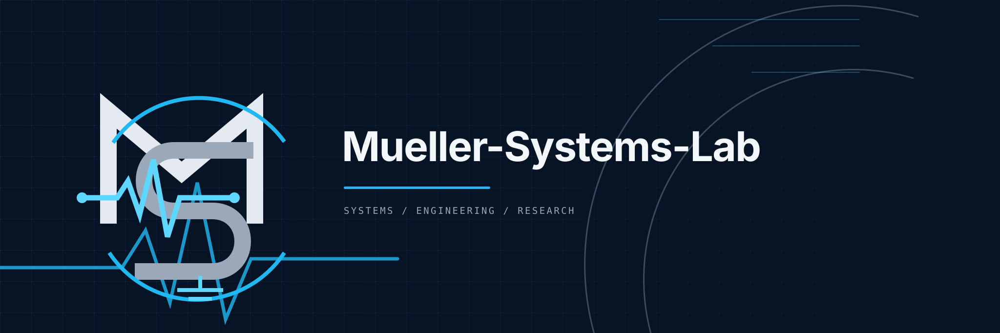

  

# Mueller-Systems-Lab

Mueller-Systems-Lab builds evidence-driven software and technical systems at the intersection of AI-assisted engineering, diagnostics, automation and local-first tooling.

## Focus areas

- AI-assisted engineering with explicit human and system boundaries
- diagnostics, evidence capture and reproducible validation
- local-first software and privacy-aware automation
- developer tooling and governed agent workflows
- hardware/software integration and safety-aware systems

## Selected public projects

- [Positron](https://github.com/Mueller-Systems-Lab/Positron) — evidence-gated issue-to-PR orchestration for supervised autonomous coding workflows.
- [OpenCode-Agenten-Oekosystem](https://github.com/Mueller-Systems-Lab/OpenCode-Agenten-Oekosystem) — governed, versioned agent tooling for OpenCode projects.
- [Rechtssoftware](https://github.com/Mueller-Systems-Lab/Rechtssoftware) — local, privacy-oriented support for personal legal and administrative work.
- [promptvault-lite](https://github.com/Mueller-Systems-Lab/promptvault-lite) — local-first tooling for managing and analyzing prompt collections.

Projects retain their own product identities. The organization mark is an endorsement of provenance and engineering ownership, not a replacement for a project name or interface.

## Engineering principles

- Evidence outranks assertion.
- Local execution is preferred when it improves privacy, control or reproducibility.
- Safety boundaries and human authority remain explicit.
- Operational claims are tied to current, inspectable evidence.
- Product scope and architecture are kept legible.

## Links

- [Organization repositories](https://github.com/Mueller-Systems-Lab?tab=repositories)

---

Developed by **Mueller-Systems-Lab** — engineering systems for diagnostics, automation and evidence-driven software.
